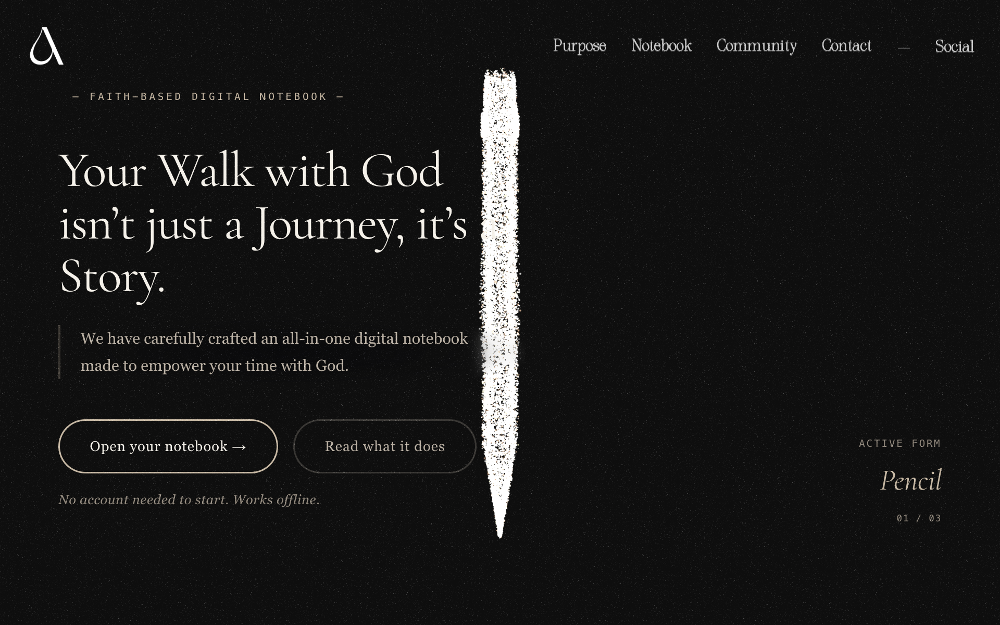

# Live Psalms

**The notepad that remembers what God has been saying** — across your devotions, your sermons, and the threads you've been walking with for months.

Live Psalms is a Bible‑study notepad and journal. You write the way you already do — a morning devotion, notes from Sunday's sermon, a theme you keep circling — and the app quietly threads those entries together by the scripture, words, and questions they share. Over time it becomes an illuminated record of what you've been reading, praying, and returning to, instead of a pile of notes you can never find again.

It's private by default, and you can start writing straight away — no account needed. Sign in only when you want your writing to follow you across your phone, tablet, and computer.

---

## What it's for

Live Psalms is made for anyone who studies and journals scripture over the long haul — daily devotions, sermon notes, prayers, and the themes you return to across months and years. Most note apps let those entries pile up and drift apart. Live Psalms keeps them connected, so the through‑line of what God has been saying to you stays visible.

It's built for depth and continuity, not quick capture and forget.

---

## What it does

**One quiet place for three kinds of writing.**
The devotion you wrote this morning, the sermon you jotted down Sunday, and the theme you've been walking with for months were never really separate — only stored that way. Live Psalms keeps them in one place and understands which kind of writing each note is, so they can be threaded together by what they share.

**Scripture, right where you're writing.**
Type a Bible reference and the verse appears inline — hover to read the whole thing without losing your place. A full Bible reader sits alongside your notes whenever you want to study a passage more closely, complete with word meanings and cross‑references.

**A map of how it all connects.**
Every scripture you return to and every theme you keep circling gets drawn into a living map. It shows you the lines you couldn't see while you were writing — and you can tap any verse to find every note that touches it.

**Lamplight — a companion that's been reading along.**
Lamplight is an optional guide that reads *your own* pages and gives them back to you: a short **daily reading** written for the season you're actually in, a gentle **weekly summary** of the threads your notes have started, and longer **reflections** that trace what you've walked through. It stays off until you invite it, keeps your writing private, and always shows you which note, verse, and date it drew from.

**A place to study and to memorize.**
A focused study space lets you sit with a passage, and a built‑in memorize tool helps you commit verses to memory.

**Markers for the road you've walked.**
Reflections gather the seasons you've been through, and a set of gentle milestones — each rooted in a verse — honors slow, faithful work rather than streaks and scores.

**Capture it however it comes.**
- **Speak it** — record a voice note and have it written up for you.
- **Snap it** — photograph a handwritten page and turn it into a note.
- **Bring it with you** — import what you've already written from documents, Word files, notes, and Apple Notes; it links itself in by the scripture it shares.

**Pages that suit the moment.**
Choose from seven journal paper styles — some mornings want a clean page, some want lined, some want something warmer.

**Yours, and only yours.**
Write offline with no account; sign in when you want it to sync everywhere. Your notes are yours to keep, move, and carry with you.

---

## Your writing stays private

Lamplight is **off until you invite it**, runs **private by default**, is **never used to train anything**, and **always cites** the note, verse, and date behind whatever it offers. What is yours, stays yours.

---

*The first page is open.*
